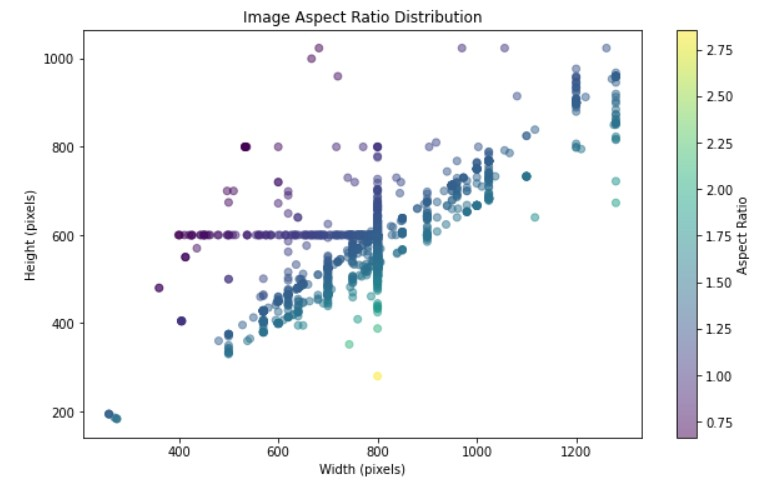
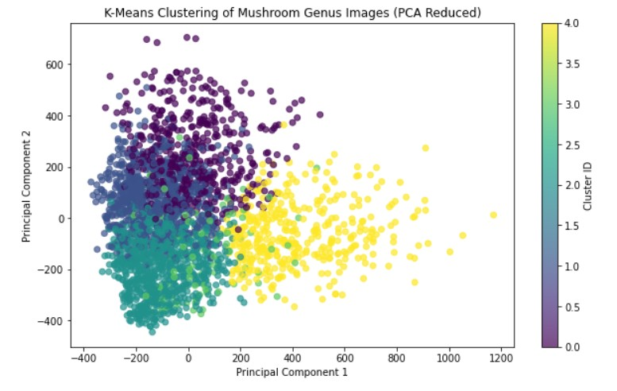
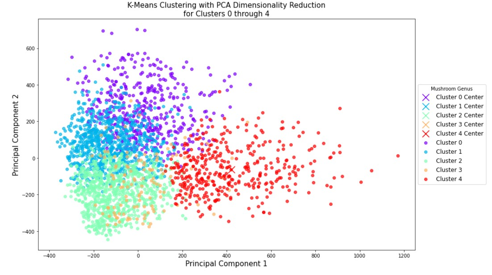
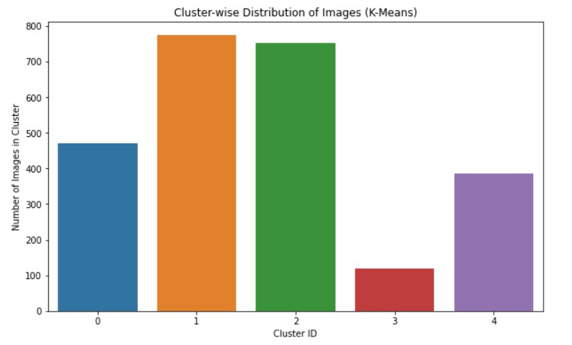
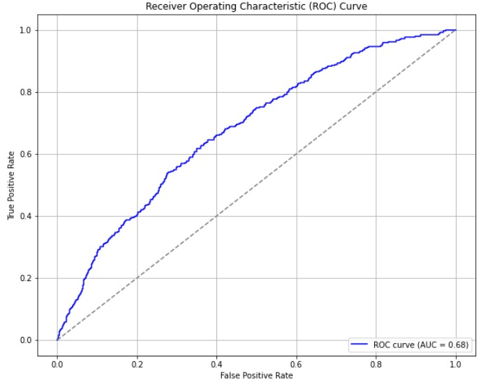
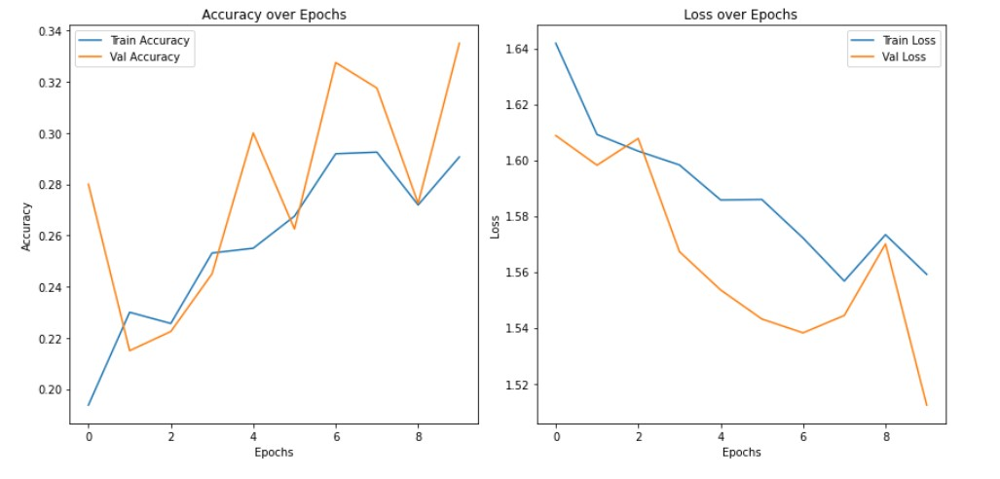
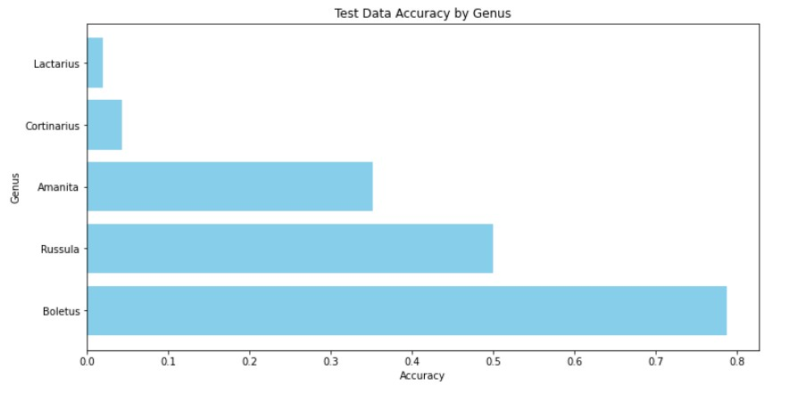
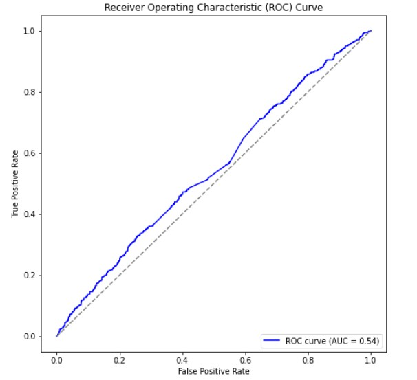
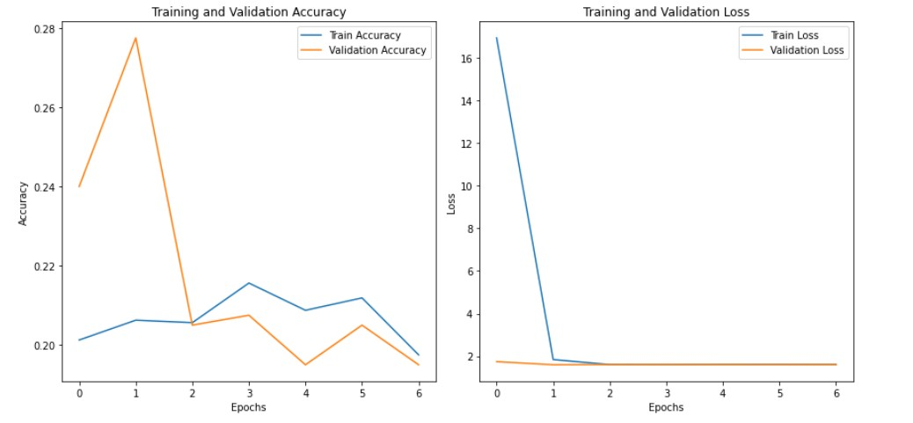
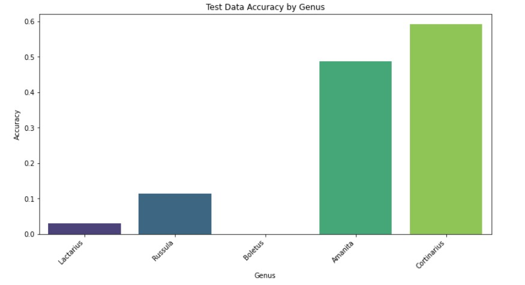

# Mushroom Classification
Machine Learning Project

## Overview
This project focuses on predicting the genus of mushrooms using machine learning techniques. The dataset used contains nine of the most common Northern European mushroom genuses. The goal is to demonstrate the application of Convolutional Neural Networks (CNNs) and Deep Neural Networks (DNNs) for classification tasks.

## Problem Statement
Mushrooms are a diverse and rich species, with some edible varieties and others that are poisonous. Accurate classification based on physical features can play a critical role in safety, especially in the context of foraging for edible mushrooms. This project aims to test the accuracy of predictive model accuracy for genus classification. 

## Dataset
The dataset is from [Kaggle](https://www.kaggle.com/datasets/maysee/mushrooms-classification-common-genuss-images/data), containing nine folders with 300–1500 images each (totaling nearly 2 GB).

## Objective
The main objective of this project is to build and compare two classification models that can predict the genus of mushrooms based on images. By applying machine learning algorithms such as Convolutional Neural Networks (CNN) and Deep Neural Networks (DNN), the models will classify each image into one of the five genus classes.

## Methods Used

### Data Preprocessing:
The dataset was reduced to five genuses, and each was randomly capped at 500 images for balance and manageability.

### Model Development:

-**Non-Supervised Learning Model**:
-*K-Means Clustering*: K-Means is a clustering algorithm used to groups data points into clusters based on their similarity. 

-**Supervised (or Self-Supervised) Learning Models**:

-*Convolutional Neural Networks (CNNs)*: CNNs were utilized for image-like feature extraction from structured data.

-*Deep Neural Networks (DNNs)*: A multi-layer neural network was used to learn complex patterns in the data and predict the correct class label.

### Model Evaluation:
The models were evaluated using metrics such as accuracy, precision, recall, and F1-score to ensure reliable performance. In addition, ROC curves were plotted to visually assess the trade-off between true positive rate (sensitivity) and false positive rate. The AUC (Area Under the Curve) was calculated to provide a single-number summary of the model's ability to distinguish between classes.

## Model Performance
The performance of the models was assessed on a test dataset to evaluate their ability to generalize to unseen data.

### CNN
- Test Loss: 1.5037  
- Test Accuracy: 0.3480  
- AUC: 0.68

### DNN
- Test Loss: 1.6045  
- Test Accuracy: 0.2440  
- AUC: 0.54

CNN outperformed DNN in both accuracy and AUC, which aligns with expectations for image data. 

## Conclusion
This project demonstrates the use of deep learning for biological image classification. CNNs proved more effective than DNNs for this task, reinforcing their advantage in image-related modeling.

## Future Work
- **Model Improvement**: Try Random Forest, XGBoost, and more refined hyperparameter tuning.
- **Data Enhancement**: Incorporating higher-quality, possibly 360° images could improve results.

# Acknowledgements
Kaggle for providing the dataset.
